# Metimur (Databricks SQL Benchmark Accelerator)

"Metimur", translating to "We Measure", is designed with the following key objectives:

- Streamlining the process of data generation and query benchmarking
- Evaluating query performance in Databricks SQL warehouses
- Eliminating reliance on sensitive data by creating synthetic data based on table schemas

This accelerator utilizes DatabricksLabs [dbldatagen](https://github.com/databrickslabs/dbldatagen) library for DataFrame generation, and [Beaker](https://github.com/goodwillpunning/beaker) library for query benchmarking 


# Table of Contents
- [Requirements](#requirements)
- [When to Use](#when-to-use)
    - [Use Case 1: Benchmark existing data](#use-case-1-benchmark-existing-data)
        - [Setup](#setup)
        - [Output](#output)
    - [Use Case 2: Generate Data from Schema](#use-case-2-generate-data)
        - [Setup](#setup-1)
        - [Output](#output-1)
    - [Use Case 3: Generate TPC Data](#use-case-3-generate-data)
        - [Setup](#setup-2)
        - [Output](#output-2)
    - [Use Case 3: Use Databricks Execute SQL API](#use-case-4-use-databricks-execute-sql-api)
        - [Setup](#setup-3)
        - [Output](#output-3)

# Requirements
* Databricks workspace with Serverless and Unity Catalog enabled
* Python 3.9+

# When to Use

## Use Case 1: Benchmark existing data
You have existing data in Databricks workspace and you want to compare query performance across different Databricks SQL warehouse types or sizes with different level of concurrency 

The **quickstart** notebook provides a convenient way to execute queries concurrently using [Databricks SQL Connector](https://docs.databricks.com/en/dev-tools/python-sql-connector.html) with ODBC driver on **Databricks workspace** with existing data, and easily benchmark the query duration on Serverless, Pro, and Serverless warehouses.  

>**Note**: You should have **existing data** available in the workspace to proceed. If you don't have available data, the default data used in the notebook is `tpch` data in `samples` catalog along with tpch sample queries in `queries` folder of this repo. If you want to use TPCH and TPCDS data with different scale factor, or generate your own data with defined schema, go to **Advanced** notebook.

### Setup

Clone this repo and add the repo to your Databricks Workspace. Refer to [Databricks Repo](https://docs.databricks.com/en/repos/repos-setup.html) for instruction on how to create Databricks repo on your own workspace

1. Open **quickstarts** notebook on Databricks workspace.
2. Follow the instruction in the notebook
3. Click `Run/Run All`

### Output

With **one-warehouse** benchmark option, you can view the average duration of each query

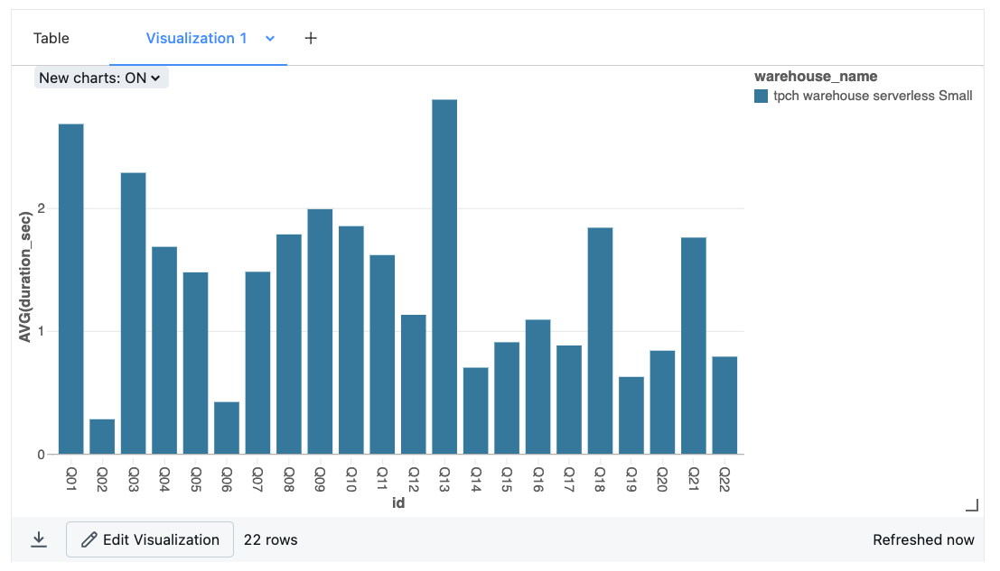

With **multiple-warehouses** benchmark option, three types of warehouses - serverless, pro, and classic - are automatically generated. They will have the same size based on warehouse_size widget and their names will be prefixed with the warehouse_prefix widget.

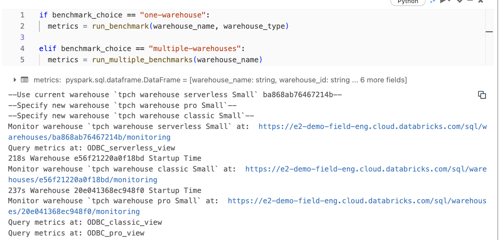

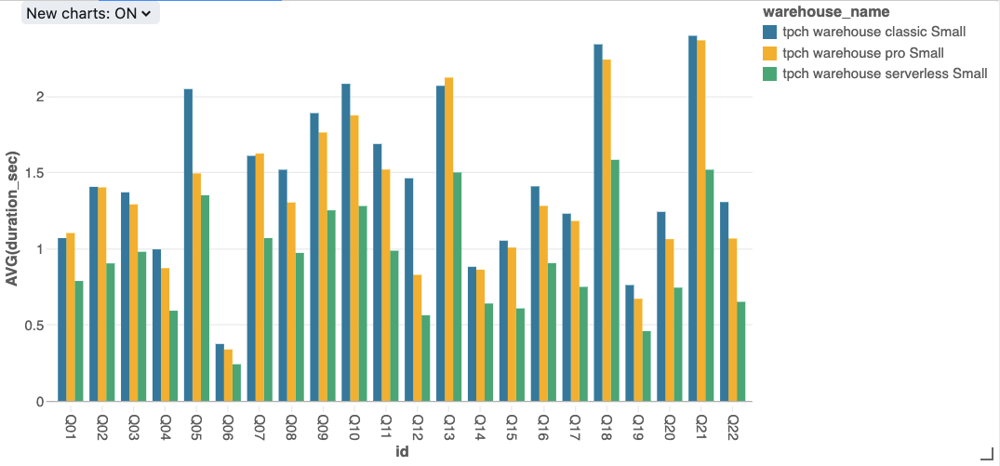

With **multiple-warehouses-size** benchmark option, you can choose multiple warehouse sizes from the drop down **warehouse_size** widget. These warehouse will be created with have the same type based on **warehouse_type** widget and their names will be prefixed with the **warehouse_prefix** widget.

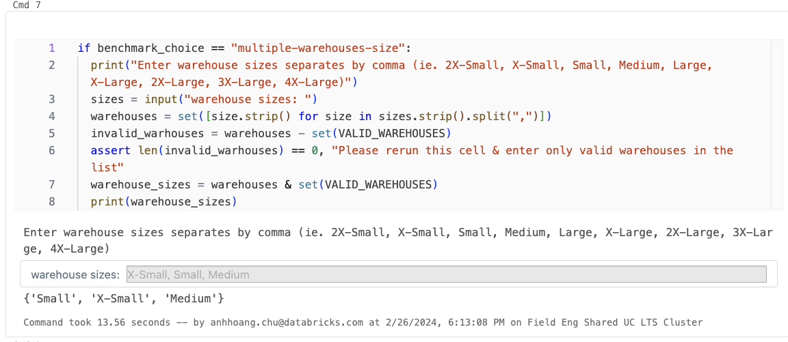

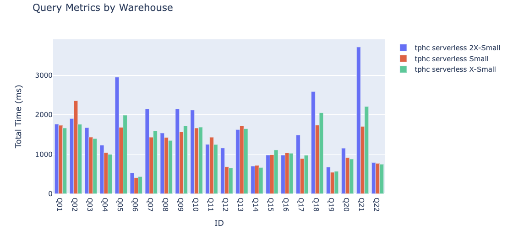

**Note: The query duration is fetched from Query History API and should be consistent with query duration on Databricks monitoring UI**


## Use Case 2: Generate Synthectic Data based on table schemas

You want to generate synthetic data based on table schemas, and benchmark the query duration at different concurrency levels on Databricks SQL Warehouses

### Setup

Clone this repo and add the repo to your Databricks Workspace. Refer to [Databricks Repo](https://docs.databricks.com/en/repos/repos-setup.html) for instruction on how to create Databricks repo on your own workspace

1. Open **advanced** notebook on Databricks workspace.
2. Run each cell in "Set Up" section
3. Choose `BYOD` in the drop down **benchmarks** widget
4. Upload your user-defined schema file for each table to the **schemas** folder. Follow the example in **schemas/tpch**. Schema for each table should follow below pattern: 

    ```json
    {
        "table_name": "customer",
        "rows": 750000,
        "fields": [
            {
                "colName": "c_custkey",
                "colType": "bigint",
                "uniqueValues": null,
                "values": [],
                "minValue": null,
                "maxValue": null
            },
            {
                "colName": "c_mktsegment",
                "colType": "string",
                "uniqueValues": 5,
                "values": [
                    "MACHINERY",
                    "AUTOMOBILE",
                    "BUILDING",
                    "HOUSEHOLD",
                    "FURNITURE"
                ],
                "minValue": null,
                "maxValue": null
            }
        ]
    }
    ```

### Output

1. An automated Workflow job is created with 2 tasks: Generate_Data and Run_Benchmarking

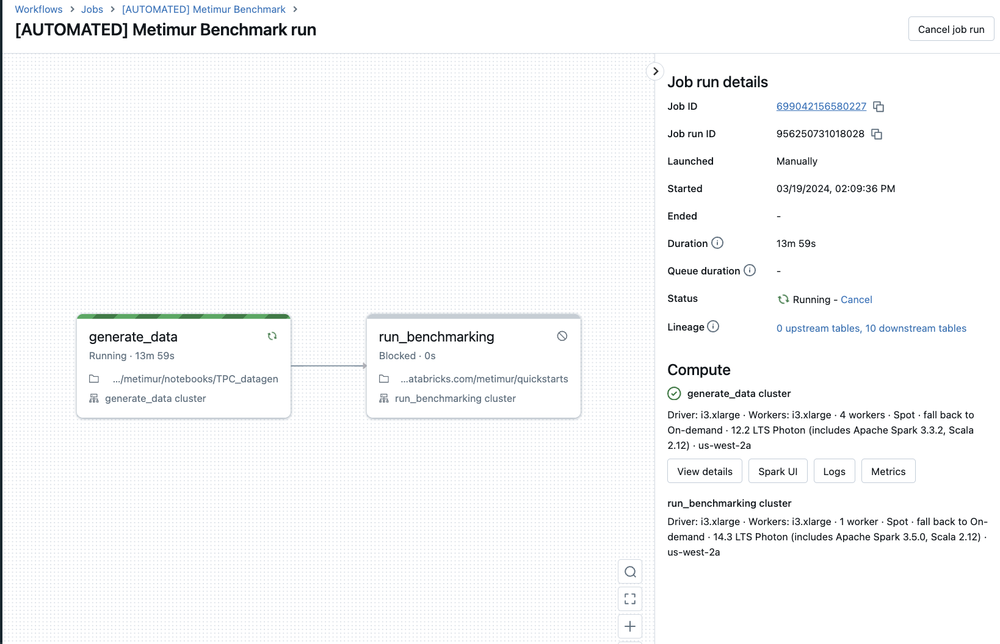

2. In **generate_data** task, data are generated in Unity Catalog
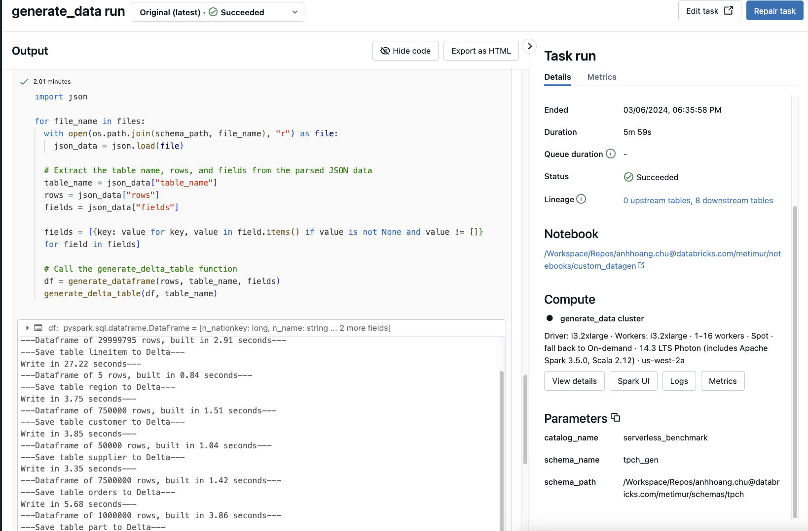

3. In the **run_benchmarking task**, benchmark queries are executed on the generated data

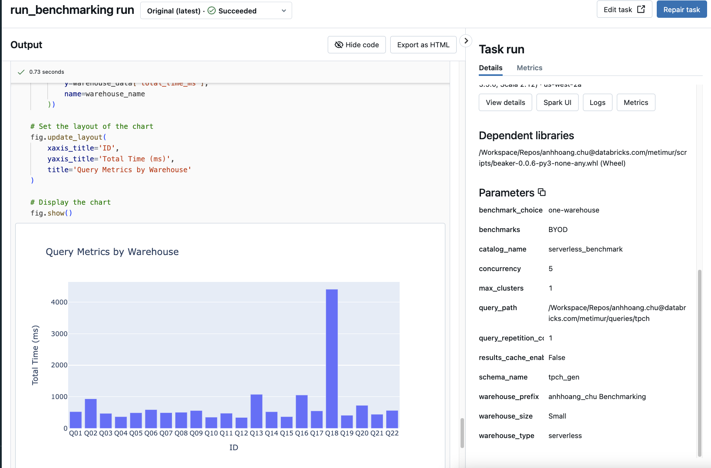


## Use Case 3: Generate TPC Data

You want to test Databricks SQL Warehouses performance at different scale factors of TPC Industry benchmark Data.

### Setup

Clone this repo and add the repo to your Databricks Workspace. Refer to [Databricks Repo](https://docs.databricks.com/en/repos/repos-setup.html) for instruction on how to create Databricks repo on your own workspace

1. Open **advanced** notebook on Databricks workspace.
2. Run each cell in "Set Up" section
3. Choose `TPCH` or `TPCDS` in the drop down **benchmarks** widget and the **scale factors**

### Output

1. An automated Workflow job is created with 2 tasks: Generate_Data and Run_Benchmarking


2. In **generate_data** task, data are generated in Unity Catalog


3. In the **run_benchmarking task**, benchmark queries are executed on the generated data

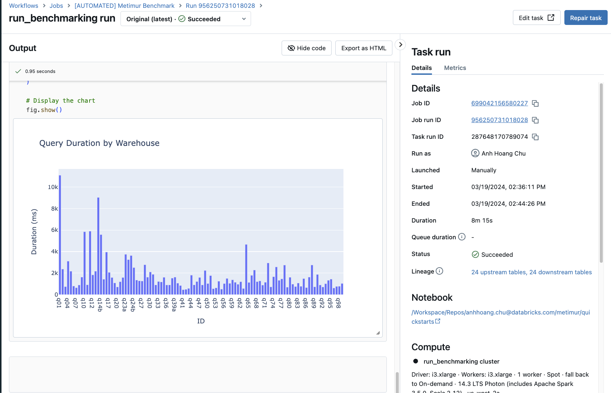

4. If the TPC data already exists, an automated Workflow job is created with only the Run_Benchmarking task. The Generate_Data task is skipped in this case.

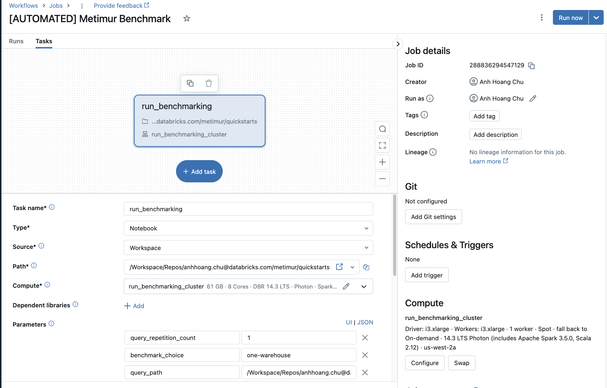

## Use Case 4: Use Databricks Execute SQL API

You want to use Databricks warehouses from local machine or an application:
* execute queries with parameters on Databricks SQL warehouse from your local machine using [Databricks Execute SQL API](https://docs.databricks.com/api/workspace/statementexecution/executestatement). 
* download the data to csv files
* and aggregate query duration from Query History API


**Repreqs**:
* Python 3.9+ installed on your local machine
* Access to Databricks workspace, and permission to create Personal Access Token
* Access to an existing Databricks SQL Warehouse

### Setup

1. Clone this repo to your local machine, in your terminal 
* Go to `cd metimur/extras/quickstarts_restapi_standalone`

2. Upload your query file to `queries` folder, replace any required params with `:param_name`. Refer to `tpch_w_param.sql` file for sample queries with params or Databricks [API doc](https://docs.databricks.com/api/workspace/statementexecution/executestatement)

3. Duplicate the .env_sample file, rename the copy to .env, and populate it with your specific environment variables.
```
HOST=xxxxx.cloud.databricks.com
AUTH_TOKEN=dapixxxxxxxxxxxxxxxxxxxxxxxxxxxxxxxxxxxxxx
WAREHOUSE_ID=475xxxxxx
CATALOG=samples
SCHEMA=tpch
USER_NAME = ""
```

<details>
<summary>Instructions to obtain the above values</summary>

* HOST: aka [Workspace Instance Name](https://docs.databricks.com/en/workspace/workspace-details.html) can be located on the browser when you login to Databricks workspace

* AUTH_TOKEN: aka Databricks [personal access token](https://docs.databricks.com/en/workspace/workspace-details.html)

* WAREHOUSE_ID: Use an already-existed warehouse or create a new one in your Databricks workspace before proceeding. From Databricks workspace, go to `SQL Warhouses`, choose your warehouse, `Connection details`, the warehouse ID is the last part of HTTP path `/sql/1.0/warehouses/<warehouse_id>`

* CATALOG and SCHEMA: of the tables you want to query

* USER_NAME: the user name you used to access the workspace and run the queries

</details>

4. Create a python virtual environment, and install required packages. In your terminal inside your cloned directory, run the following:
```
python3 -m venv myvenv

source myvenv/bin/activate

pip install -r requirements.txt
```

5. Run the `quickstarts_restapi_standalone` file

```
python quickstarts_restapi_standalone.py 
```

### Output

**Download Example Output**

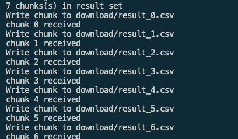

**Benchmark Example Output**
The average query duration will show in your terminal similar to below:
```
         duration
query            
Q1     811.776923
Q2     657.579487
Q3     420.361538
...
```
