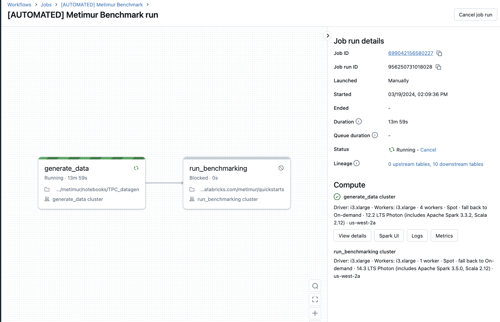
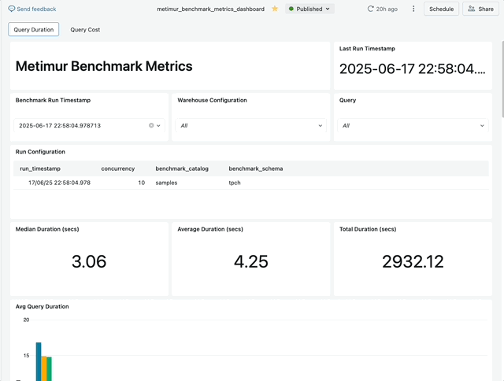

# Metimur 🦊

[](https://www.python.org/downloads/)
[](https://docs.databricks.com/release-notes/runtime/14.3.html)
[](https://docs.databricks.com/aws/en/data-governance/unity-catalog)

> "Metimur" (Latin for "We Measure") is a Databricks SQL Benchmark Accelerator that streamlines data generation and query benchmarking in Databricks SQL warehouses.

[](https://www.youtube.com/watch?v=JBlqoay8_3o)


# Table of Contents
- [Use Case 1: Benchmark existing data](#use-case-1-benchmark-existing-data)
- [Use Case 2: Generate Synthetic Data based on table schemas](#use-case-2-generate-synthetic-data-based-on-table-schemas)
- [Use Case 3: Generate TPC Data](#use-case-3-generate-tpc-data)
- [Benchmark Output: Metrics Dashboard](#benchmark-output)
- [Limitations](#limitations)

## ✨ Features

- 🚀 Streamline data generation and query benchmarking
- 📊 Evaluate query performance across different Databricks SQL warehouse types
- 🔒 Generate synthetic data based on table schemas
- 📈 Built-in support for TPC-DS and TPC-H benchmarks
- 📊 Automated AI/BI Metrics Dashboard for performance analysis

## 🚀 Quick Start

### Prerequisites

- Databricks workspace with Serverless and Unity Catalog enabled
- Python 3.9+
- Databricks Runtime 14.3+

### Installation

Add the repo to your Databricks Workspace using [Databricks Repos](https://docs.databricks.com/en/repos/repos-setup.html)


## Use Case 1. Benchmark Existing Data

> **Prerequisite**: You must have existing data available in your Databricks workspace to use this feature.

Compare query performance across different Databricks SQL warehouse types and sizes with varying concurrency levels. This use case is ideal when you want to benchmark your actual production or test data.

- Single Warehouse Benchmark: View average query duration for one warehouse.

- Multiple Warehouses Benchmark: Automatically creates serverless, pro, and classic warehouses (same size, names prefixed by warehouse_prefix).

- Multiple Warehouses, Varying Sizes: Select multiple sizes for one warehouse type (set by warehouse_type), with names prefixed by warehouse_prefix.

#### Getting Started

1. **Verify Data Availability**
   - Ensure your data is already loaded into your Databricks workspace
   - Data should be accessible through Unity Catalog
   - If you don't have data, consider using Use Case 2 (Generate Synthetic Data) or Use Case 3 (TPC Benchmark Data)

2. Open the **quickstarts** notebook in your Databricks workspace
3. Connect to a Single User Cluster (DBR14.3 LTS or above)
4. Upload your queries to the `queries` directory
5. Follow the notebook instructions

#### Query Format Requirements

1. **Basic Query Format**
   - Each query must be identified using `--` markers
   - Each query must end with a semicolon `;`
   - Example:
   ```sql
   --Q01--
   SELECT * FROM lineitem;
   ```

2. **Multiple Queries in One File**
   - You can include multiple queries in a single file
   - Each query must follow the format above
   - Example:
   ```sql
   --Q01--
   SELECT * FROM lineitem;

   --Q02--
   SELECT * FROM orders;
   ```

3. **Parameterized Queries**
   - Use `:param_name` syntax for parameters in your queries
   - Create a `params.json` file in the same directory as your queries
   - Format your `params.json` as follows:
   ```json
   {
       "Q01": [
           {
               "l_shipdate": "1998-12-01"
           },
           {
               "l_shipdate": "1998-11-01"
           }
       ],
       "Q02": [
           {
               "p_size": 15,
               "p_type": "%BRASS",
               "r_name": "EUROPE"
           }
       ]
   }
   ```

4. **Example Files**
   - See `queries/tpch` or `queries/tpcds` folders for complete examples
   - Each folder contains:
     - SQL query files
     - `params.json` (if using parameterized queries)


**Note: The query duration is fetched from Query History API and should be consistent with query duration on Databricks monitoring UI**

## Use case 2. Generate Synthetic Data (⚠️ Under Development)

Generate synthetic data based on table schemas and benchmark query performance. Note: This feature is currently under development and may not work as expected.


### Getting Started

1. Open **advanced** notebook on Databricks workspace.
2. Connect the notebook to Single User Cluster with DBR14.3+ LTS
3. Run each cell in "Set Up" section
4. Choose `BYOD` in the drop down **benchmarks** widget
5. Upload your user-defined schema file for each table to the **schemas** folder. Follow the example in **schemas/tpch**. 

    <details>
    <summary>Table Schema Example</summary>
    
    ```json
    {
        "table_name": "customer",
        "rows": 750000,
        "fields": [
            {
                "colName": "c_custkey",
                "colType": "bigint",
                "uniqueValues": null,
                "values": [],
                "minValue": null,
                "maxValue": null
            },
            {
                "colName": "c_mktsegment",
                "colType": "string",
                "uniqueValues": 5,
                "values": [
                    "MACHINERY",
                    "AUTOMOBILE",
                    "BUILDING",
                    "HOUSEHOLD",
                    "FURNITURE"
                ],
                "minValue": null,
                "maxValue": null
            }
        ]
    }
    ```
    </detail>

6. Upload the queries to a separate folder under **queries** directory, and provide the path in **Query Path** widget. Follow instruction in [Use Case 1: Benchmark existing data](#use-case-1-benchmark-existing-data)

    
### Output

1. An automated Workflow job is created with 2 tasks: Generate_Data and Run_Benchmarking



2. In **generate_data** task, data are generated in `serverless_benchmark` catalog and user-specified schema name

3. In the **run_benchmarking task**, benchmark queries are executed on the generated data


## Use Case 3: Generate TPC Data

You want to test Databricks SQL Warehouses performance at different scale factors of TPC Industry benchmark Data.

### Getting Started

1. Open **advanced** notebook on Databricks workspace.
2. Connect the notebook to Single User Cluster with DBR14.3+ LTS
3. Run each cell in "Set Up" section
4. Choose `TPCH` or `TPCDS` in the drop down **Benchmarks** widget and the **Scale Factors**
5. Set the **Query Path** widget to `queries/tpch` or `queries/tpcds`

### Output

1. An automated Workflow job is created with 2 tasks: Generate_Data and Run_Benchmarking

2. In **generate_data** task, TPC data are generated in `serverless_benchmark` catalog and `tpch_{scale_factor}` schema

3. In the **run_benchmarking task**, benchmark queries are executed on the generated data similar to Use Case 2

**Note**: To avoid re-generate these industry benchmarks data, after data is generated, all users in the workspace will be able to query the tables and run benchmark queries on them. If the schemas and tables already exist, the Generate Data task will be skipped

## 📊 Benchmark Output

All benchmark results are stored in a Delta table (`serverless_benchmark.default._metimur_metrics_{user_name}`) and visualized in an automated Databricks AI/BI Metrics Dashboard.
- Option to filter the benchmark run by benchmark timestamp, warehouse configuration (warehouse size, warehouse type), or query ID
- Analyze query duration based on query history table
- Analyze query cost (DBUs, $DBUs) using UC system tables



## ⚠️ Limitations

- Metimur exclusively supports Unity Catalog managed tables. A default catalog named `serverless_benchmark` is automatically provisioned to store all TPC and synthetic data.

- Workspace users receive the following Unity Catalog permissions:
  - `USE CATALOG`, `CREATE SCHEMA`, `USE SCHEMA`, and `CREATE TABLE` on the `serverless_benchmark` catalog
  - `SELECT` permission on all TPC benchmark tables
  For more details, see [Unity Catalog Privileges documentation](https://docs.databricks.com/en/data-governance/unity-catalog/manage-privileges/privileges.html#unity-catalog-privileges-and-securable-objects).

- TPC benchmark data is generated only if it doesn't already exist in the catalog.

- For synthetic data generation, table permissions are restricted to the creating user only.

- Query Compatibility:
  - Validate queries on Databricks before benchmarking
  - No automatic query conversion from other EDW systems is provided
  - Ensure queries follow Databricks SQL syntax

- Performance Optimization:
  - Generated Delta tables require manual optimization
  - Recommended techniques:
    - [Liquid Clustering](https://docs.databricks.com/en/delta/clustering.html) - RECOMMENDED
    - [Z-Ordering and Partitioning](https://docs.databricks.com/en/delta/data-skipping.html#what-is-z-ordering)

## 🔒 Security & Permissions

- Default Unity Catalog `serverless_benchmark` is created automatically
- All workspace users get basic permissions on the catalog
- Synthetic data tables are accessible only to the creator
- TPC data tables are accessible to all workspace users

## 🤝 Contributing

Contributions are welcome! Please feel free to submit a Pull Request.

## 📝 License

This project is licensed under the MIT License - see the [LICENSE](LICENSE) file for details.


